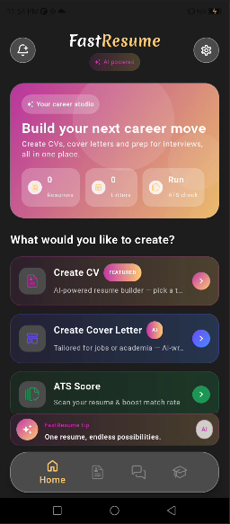

# FastResume

**FastResume** is an Android app that helps you build professional CVs and résumés, run ATS-oriented checks, and generate supporting documents such as cover letters. The UI is built with **Jetpack Compose** and **Material 3**, with local persistence

| | |
| --- | --- |
| **Package** | `com.fastresume.aicvbuilder` |
| **Min SDK** | 26 |
| **Target / Compile SDK** | 35 |
| **Version** | 2.1 (versionCode 11) |

## Features

- **Resume / CV builder** — Guided forms for personal info, work experience, education, skills, projects, languages, achievements, certifications, publications, references, and hobbies.
- **Templates** — Multiple HTML-based resume templates with preview; export and sharing workflows.
- **CV preview** — Live-style preview of the assembled résumé before export.
- **Cover letters** — Flows for job-focused and academic/university cover letters, including AI-assisted content where implemented in the app.
- **ATS check** — Résumé check tooling with a dedicated results view (AST/ATS engine screens).
- **History** — List and manage generated CVs and related documents; rename and organize entries.
- **Interview reminders** — Notification-based reminders and scheduling (exact alarms and boot-friendly receiver where permitted).
- **Ai Tools** - Dream Job RoadMap AI, Portfolio Project ideas
- **Onboarding** — First-run experience and optional dashboard guide overlay.
- **DarkMode** - Dark Mode and Light Mode is Available
- **Settings** — Account management, help & support, about, and privacy policy screens.

## Tech stack

- **Language:** Kotlin  
- **UI:** Jetpack Compose (2025.08.01), Material 3, Navigation Compose  
- **DI:** Dagger Hilt  
- **Local DB:** Room  
- **Networking:** Retrofit, OkHttp  
- **Images:** Coil, Glide (with KSP)  
- **PDF:** PDFBox Android  
- **PDF Text Extraction:**  PDFTextStripper()
- **Async:** Kotlin coroutines (including Guava interop where used)  
- **Other:** Lottie, ZXing, Play In-App Review, Google Drive API / OAuth client libraries (for integrations in-app)

## Project structure (high level)

- `app/src/main/java/com/fastresume/aicvbuilder/` — Application code (UI, view models, ads, analytics, security helpers, notifications).
- `app/src/main/assets/` — HTML resume templates and related assets.
- `app/google-services.json` — Firebase / Google services configuration (see below).

## Requirements

- **Android Studio** (recent stable; project uses AGP 8.12.x and Kotlin 2.0.x).  
- **JDK 11** (as configured in Gradle).  
- **Android SDK** with API 35 for development builds.

## Screenshots

## Build & run

1. Clone repository (private repo; use credentials or SSH as configured in your Git environment).
2. Open the project in Android Studio (open the project root).

3. **SDK path:** create in the project root if it is not present (it is not committed) with your SDK location, for example:

4. **Google services:** this repository includes `app/google-services.json` for team and CI use on a **private** remote. The app will not run Firebase/Google services features correctly without a valid file matching your Firebase project and app id.

5. Sync Gradle and run the `app` configuration on a device or emulator (API 26+).

To build from the command line:

Release builds follow your usual signing setup (keystore is not part of the repo).

## Git and large pushes

For large repositories or slow connections, a higher HTTP post buffer can help:

